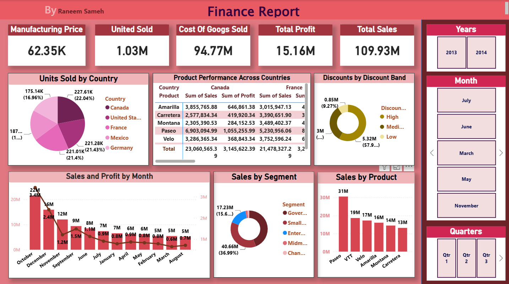

# 📊 Financial Sales Dashboard | Power BI

## 📌 Project Overview

This project is an interactive **Financial Sales Dashboard** built using **Microsoft Power BI**. It provides a comprehensive analysis of financial performance through dynamic visualizations, KPIs, and interactive filters to help stakeholders monitor sales trends and make data-driven decisions.

---

## 🎯 Objectives

- Analyze overall financial performance.
- Track sales across different dimensions.
- Monitor profit and revenue trends.
- Identify top-performing products, segments, or regions.
- Build an interactive dashboard for business decision-making.

---

## 🛠️ Tools & Technologies

- Microsoft Power BI
- Power Query
- DAX (Data Analysis Expressions)
- Data Modeling

---

## 📈 Dashboard Features

- 📌 KPI Cards
  - Total Sales
  - Total Profit
  - Total Revenue
  - Other key business metrics

- 📊 Interactive Charts
  - Sales Trend Analysis
  - Profit Analysis
  - Category Comparison
  - Regional Performance

- 🎛️ Interactive Filters (Slicers)
  - Year
  - Quarter
  - Month
  - Other business dimensions

- 📉 Dynamic Visualizations
  - Bar Charts
  - Line Charts
  - Pie/Donut Charts
  - Tables & Matrices

---

## 📂 Dataset

The dashboard is built using a financial dataset containing information such as:

- Sales
- Profit
- Revenue
- Products
- Countries/Regions
- Date
- Customer Segments

---

## 📊 Key Insights

- Monitor business performance over time.
- Compare profitability across categories.
- Identify high-performing regions.
- Analyze seasonal sales trends.
- Support strategic business decisions using interactive analytics.

---

## 📁 Project Structure

```
Financial Dashboard/
│
├── Financials.pbix
├── README.md
└── Screenshots/
    ├── Dashboard.png
    ├── Sales Analysis.png
    └── Profit Analysis.png
```

---

## 🚀 Skills Demonstrated

- Data Cleaning
- Data Transformation
- Data Modeling
- DAX Measures
- Time Intelligence
- Interactive Dashboard Design
- Business Intelligence
- Data Visualization

---

## 📸 Dashboard Preview


```

---

## 👤 Author

**Raneem Sameh**

---

## ⭐ If you found this project helpful, don't forget to give it a Star!
